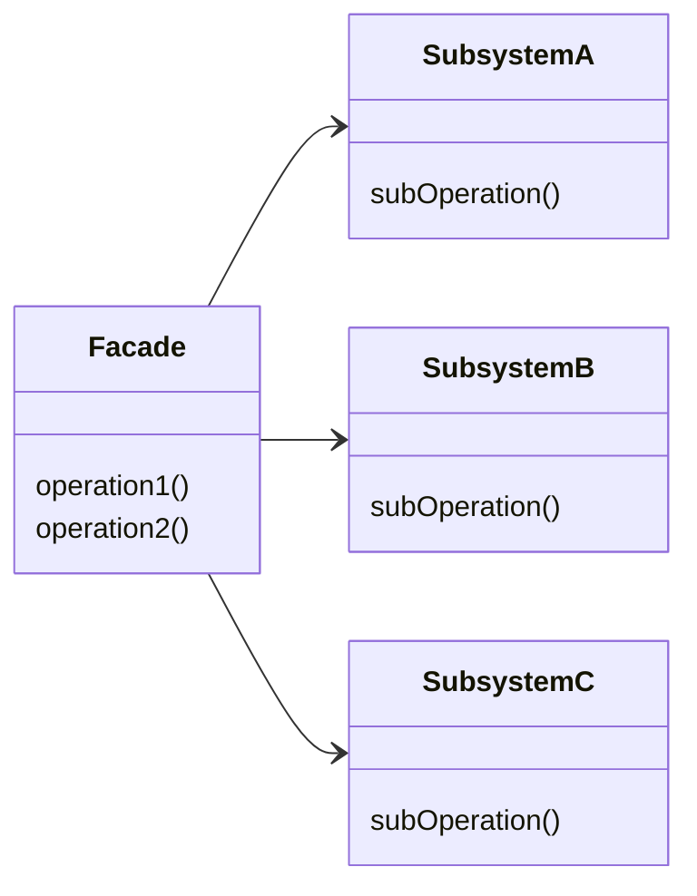

## Façade

Provide a unified interface to a set of interfaces in a subsystem. Facade
defines a higher-level interface that makes the subsystem easier to use. 
The pattern has structural purpose and applies to objects.

### When to use

* you want to provide a simple interface to a complex subsystem
* there are many dependencies between clients and the implementation classes of an abstraction
* you want to layer your subsystems, use a facade to define an entry point to each subsystem level 

## UML

## TO LEARN MORE

https://reactiveprogramming.io/blog/es/patrones-de-diseno/facade
