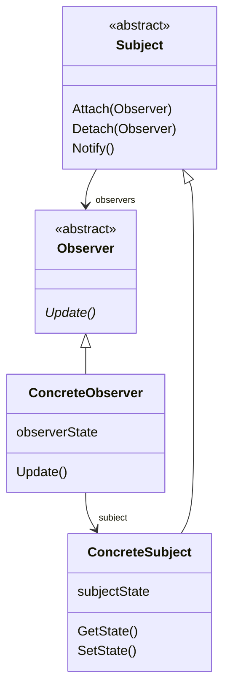

## Observer

Observer defines a one-to-many dependency between objects so that when one object 
changes state, all its dependents are notified and updated automatically. The pattern
has behavioral purpose and applies to the objects.

### When to use

* when an abstraction has two aspects, one dependent on the other
* when a change to one object requires changing others, and you don't know how many objects need to be changed
* when an object should be able to notify other objects without making assumptions about who these objects are

## UML

## TO LEARN MORE

https://reactiveprogramming.io/blog/es/patrones-de-diseno/observer
