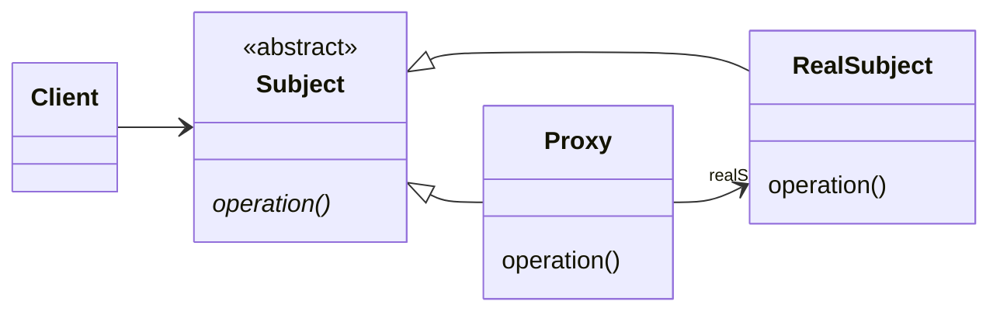

## Proxy

Proxy pattern provides a surrogate or placeholder for another object to control access to it.
The pattern has structural purpose and applies to objects. 

### When to use

* whenever there is a need for a more versatile or sophisticated reference to an object than a simple pointer

## UML

## TO LEARN MORE

https://reactiveprogramming.io/blog/es/patrones-de-diseno/proxy
