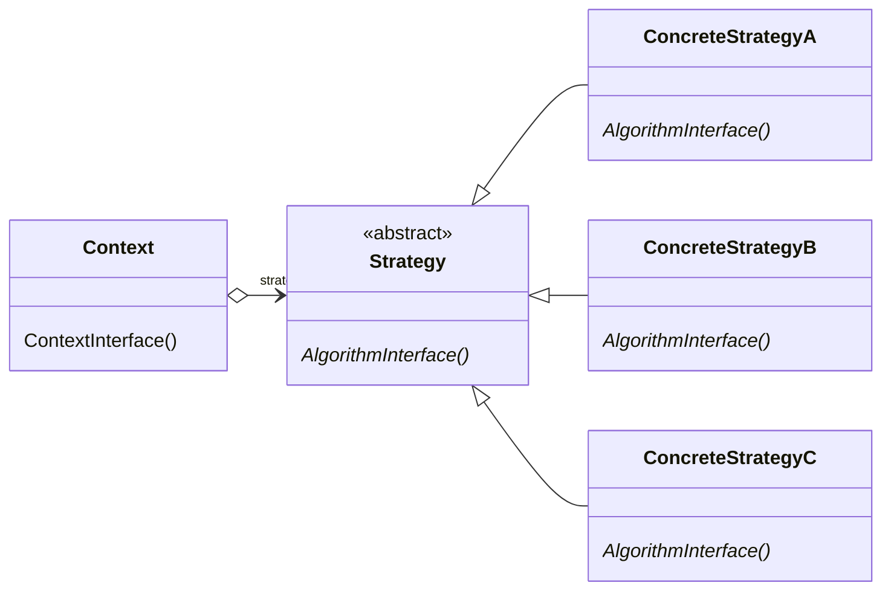

## Strategy

Strategy defines a family of algorithms, encapsulates each one, and makes them 
interchangeable. It lets the algorithm vary independently fromclients that use it. 
The pattern has behavioral purpose and applies to the objects.

### When to use

* many related classes differ only in their behavior
* you need different variants of an algorithm
* an algorithm uses data that clients shouldn't know about

## UML

## TO LEARN MORE

https://reactiveprogramming.io/blog/es/patrones-de-diseno/strategy

